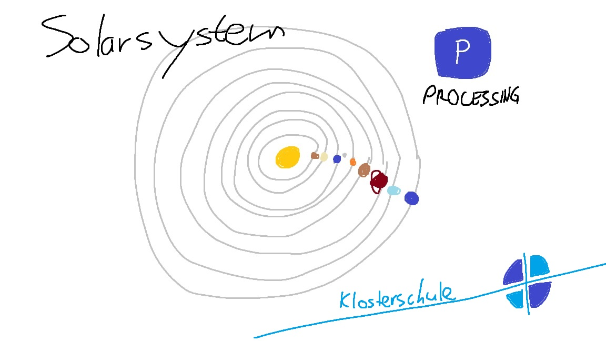

# Solarsystem

Model for solarsystem produced during computerscience class 2018 [Klosterschule Hamburg](http://www.klosterschule-hamburg.de).



## Getting Started
```sh
$ git clone https://github.com/simonh9134/solarsystem.git

  //just use the file explorer ¯\_(ツ)_/¯ or:

$ cd solarsystem
  processing solarsystem.pde
```
## Built With

* [Processing](https://processing.org/)
* [Visual Studio Code](https://code.visualstudio.com/)

## Author

**Simon Huang** - *Initial work* - [simonh9134](https://github.com/PurpleBooth/https://github.com/simonh9134)
